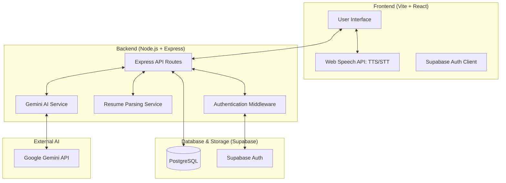

# 🏗️ Project Architecture & Pipeline

This document provides a technical overview of the **AI Interview Simulation Platform**, detailing its component-level architecture and the end-to-end interview pipeline.

---

## 🖼️ System Architecture

The platform follows a modern **three-tier architecture** with a decoupled frontend and backend, integrated with AI services for intelligence.

### 🧩 Core Components

#### 1. Frontend (React + Vite)
- **State Management**: React Hooks (useState, useEffect, useRef).
- **Voice Logic**: Direct integration with the **Web Speech API** for Text-to-Speech (reading questions) and Speech-to-Text (capturing answers).
- **Navigation**: React Router for multi-page flow.

#### 2. Backend (Node.js + Express)
- **API Layer**: REST endpoints for authentication, interview management, and history.
- **Gemini Service**: Handles interaction with Google Gemini for question generation and multi-layer evaluation.
- **Resume Service**: Extracts technical skills from PDF/DOCX using a dictionary-based local extractor.

#### 3. Database (Supabase / PostgreSQL)
- **`question_bank`**: Pre-seeded collection of technical and HR questions.
- **`interview_sessions`**: Tracks active and past interview attempts.
- **`questions`**: Stores specific questions served per session.
- **`evaluations`**: Stores detailed AI-generated feedback and scores.

#### 4. AI (Google Gemini)
- **Models**: Uses a fallback logic (`gemini-3-flash` -> `gemini-2.5-flash`) for high reliability.
- **Functionality**:
    - Generates dynamic technical questions when the database pool is exhausted.
    - Performs deep semantic evaluation of candidate answers.

---

## 🔄 Interview Pipeline (Workflow)

The following sequence describes the end-to-end lifecycle of an interview session:

### 1️⃣ Initialization & Setup
- **User Entry**: User chooses a mode: **Resume** (uploads file), **Role** (e.g., Frontend Developer), or **Topic** (e.g., React Hooks).
- **Context Extraction**: 
    - If Resume mode is chosen, the backend parses the file and extracts technical keywords using `documentWordExtractor`.
- **Configuration**: User selects Difficulty (Easy/Medium/Hard) and Question Count.

### 2️⃣ The Interview Loop (N Questions)
For each question in the session:
1. **Selection**: The backend searches the `question_bank` for questions matching the user's context (skills/role/difficulty).
2. **Dynamic Generation**: If no static question is found, **Gemini** generates a unique, context-aware question on the fly.
3. **Delivery**: Frontend receives the question and triggers the **Text-to-Speech (TTS)** engine to speak it.
4. **Response**: User records their answer (STT) or types it.
5. **Submission**: The answer is cached locally in the frontend state.

### 3️⃣ Evaluation Engine
When the interview concludes:
- **Batch Processing**: The frontend sends all answers to the `evaluate-batch` endpoint.
- **Hybrid Scoring**:
    - **Keyword Match (40%)**: Internal logic checks for the presence of "Key Points" in the candidate's answer.
    - **Semantic AI (60%)**: **Gemini** evaluates conceptual correctness, clarity, and strengths/weaknesses.
- **Session Synthesis**: Gemini generates an "Overall Feedback" summary for the entire session.

### 4️⃣ Results & Insights
- **Immediate Feedback**: User is redirected to the `Result` page.
- **Data Persistence**: Results are saved to the `evaluations` table for long-term progress tracking.
- **Actionable Advice**: For every question, the user sees:
    - ✅ Covered Points vs. ❌ Missing Points.
    - 💡 "Expert Tips" and constructive "Next Steps".

---

## 🚀 Technical Highlights

> [!TIP]
> **Hybrid Evaluation**: Unlike basic keyword matching, the platform combines structural verification (Keywords) with semantic understanding (Gemini) to provide realistic scores.

> [!NOTE]
> **Voice-First Design**: The platform uses real-time Web Speech APIs to simulate the pressure of a live interview, making it more immersive than text-only practices.
